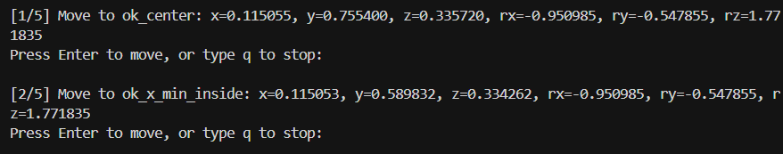
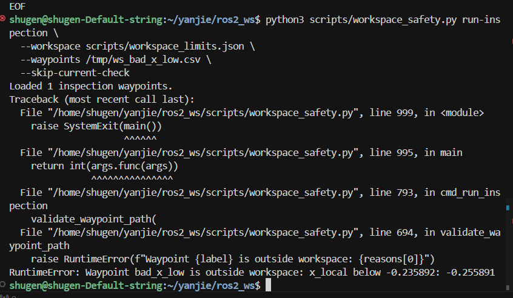

# 机械臂 TCP 安全区阶段总结

## 当前结论

我们已经完成了一版基于 TCP 位置的机械臂软件安全过滤器。它位于模型输出和机器人运动服务之间，用来检查目标点和路径采样点是否在示教得到的安全工作区内。

当前安全策略：

```text
限制对象: TCP 的 x/y/z 位置
x/y 安全距离: 5 mm
z 安全距离: 5 mm
路径采样步长: 2 mm
```

## 已完成内容

1. 编写并扩展了 `workspace_safety.py`。
2. 通过示教器重新标定了安全区，生成 `scripts/workspace_limits.json`。
3. 支持从示教点建立任务坐标系，并在该坐标系内限制 TCP 工作盒。
4. 支持 `describe` 查看安全区尺寸。
5. 支持 `self-test` 自动验证内部点、边界点、越界点。
6. 支持导出巡检点 `workspace_inspection_waypoints.csv`。
7. 支持通过 `/mov_jog` 在安全检查通过后逐点沿着边线移动以直观判断安全区域是否可行。
8. 已验证合法点可以执行，非法点会在发送运动命令前被拒绝。

## 已验证现象

合法点测试：

```text
2 个 OK 点通过 workspace_safety.py 检查。
实机执行时脚本逐点等待人工确认。
机械臂已成功移动到前两个合法点。
```




非法点测试：

```text
bad_x_low 被拒绝。
报错: Waypoint bad_x_low is outside workspace
原因: x_local below 安全区下限
结果: 未发送 /mov_jog 运动命令
```




这说明当前安全过滤链路有效：越界目标会被软件层拦截。

## 关键文件

```text
scripts/workspace_safety.py
  安全区示教、检查、巡检和执行入口。

scripts/workspace_limits.json
  当前安全区配置文件。

scripts/workspace_inspection_waypoints.csv
  自动生成的安全区内部巡检点。

scripts/readme.md
  已加入 TCP 安全区使用说明。
```

## ROS 接口

当前安全测试依赖以下 ROS2 接口：

```text
/tool_pos
  类型: common_interface/msg/TcpPos
  作用: 获取当前 TCP 位姿。
  字段: x, y, z, rx, ry, rz

/mov_jog
  类型: common_interface/srv/Move
  作用: 发送绝对 TCP 位姿运动命令。
  请求字段: a, b, c, d, e, f, name, block
  当前映射: a=x, b=y, c=z, d=rx, e=ry, f=rz
```

注意：不要直接调用 `/mov_jog` 测试非法点，否则会绕过 `workspace_safety.py` 的软件安全过滤。所有模型输出或测试点都应该先经过 `workspace_safety.py` 或后续封装的安全过滤节点。

## 文件接口

### 安全区配置

`scripts/workspace_limits.json` 的关键字段：

```json
{
  "type": "oriented_box",
  "frame": {
    "origin": [0, 0, 0],
    "axes": [[1, 0, 0], [0, 1, 0], [0, 0, 1]]
  },
  "position_limits": {
    "x": [0, 0],
    "y": [0, 0],
    "z": [0, 0]
  },
  "safety": {
    "position_clearance_m": {
      "x": 0.005,
      "y": 0.005,
      "z": 0.0
    },
    "check_orientation": false,
    "path_check_step_m": 0.002
  }
}
```

### 巡检点 CSV

`workspace_inspection_waypoints.csv` 格式：

```csv
label,x,y,z,rx,ry,rz
center,0.115055,0.755400,0.335720,-0.950985,-0.547855,1.771835
```

每一行代表一个待检查和可选执行的 TCP 目标点。

## 安全区测试常用命令

进入工作区并加载环境：

```bash
cd /home/shugen/yanjie/ros2_ws
source /opt/ros/jazzy/setup.bash
source install/local_setup.bash
```

查看安全区尺寸：

```bash
python3 scripts/workspace_safety.py describe \
  --workspace scripts/workspace_limits.json
```

自测安全区：

```bash
python3 scripts/workspace_safety.py self-test \
  --workspace scripts/workspace_limits.json
```

生成内部巡检点：

```bash
python3 scripts/workspace_safety.py export-inspection-csv \
  --workspace scripts/workspace_limits.json \
  --out scripts/workspace_inspection_waypoints.csv \
  --inset-mm 30
```

离线验证巡检路径：

```bash
python3 scripts/workspace_safety.py run-inspection \
  --workspace scripts/workspace_limits.json \
  --waypoints scripts/workspace_inspection_waypoints.csv \
  --skip-current-check
```

实机执行巡检：

```bash
python3 scripts/workspace_safety.py run-inspection \
  --workspace scripts/workspace_limits.json \
  --waypoints scripts/workspace_inspection_waypoints.csv \
  --service /mov_jog \
  --allow-entry-from-raw \
  --entry-tolerance-mm 1 \
  --execute
```

第一次实机测试不要加 `--yes`这会直接开启连续移动，可能会导致出现意外，每个点移动前都需要人工确认。

## 下一步工作

1. 把 `workspace_safety.py` 升级为在线安全过滤节点，使得模型输出数据可以直接进行过滤
2. 设计模型输出接口：模型输出 TCP 目标位姿 `[x, y, z, rx, ry, rz]`
